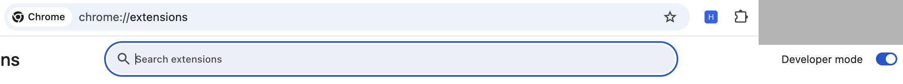
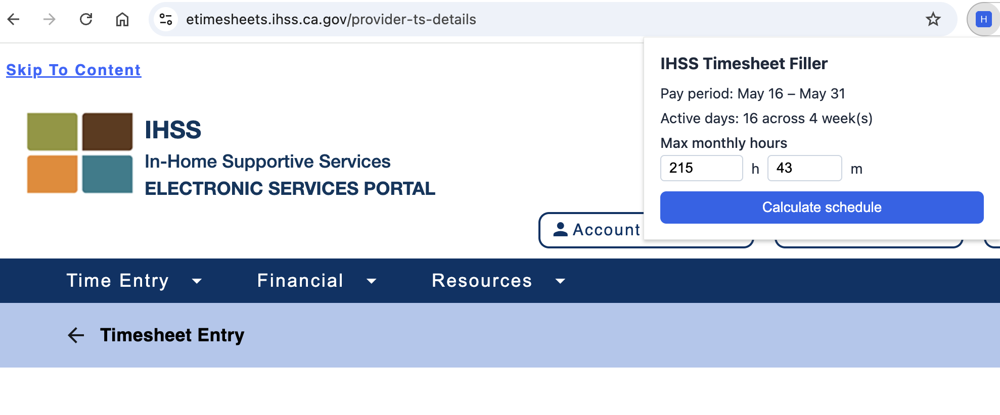

# IHSS Timesheet Filler

A Chrome browser extension that automatically fills in your IHSS provider timesheet hours. You enter your monthly hour cap, preview the generated schedule, and click one button to fill the form — then save and submit as usual.

---

## What it does

- Splits your monthly hours evenly across both pay periods
- Distributes hours evenly across every workday in the period
- Spreads any "extra hour" days across different weeks (not all in the same week)
- Puts any leftover minutes on the first day of the second half
- Handles February automatically using a 28-day (or 29-day leap year) distribution

The extension **fills** the timesheet but does **not** save or submit it. You review the filled hours, save each workweek, and click Submit Timesheet yourself.

---

## Requirements

- Google Chrome (or any Chromium-based browser such as Microsoft Edge)
- Access to [etimesheets.ihss.ca.gov](https://etimesheets.ihss.ca.gov)

---

## Installation

### Step 1: Download the extension files

Download or clone this repository to your computer. You need the `ihss-extension/` folder — that is the extension.

If you downloaded a ZIP file, unzip it first. Note where the `ihss-extension/` folder ended up (for example: `Downloads/ihss-filler/ihss-extension`).

### Step 2: Open Chrome's extension manager

1. Open Chrome.
2. In the address bar, type `chrome://extensions` and press **Enter**.

### Step 3: Turn on Developer Mode

In the top-right corner of the Extensions page, find the **Developer mode** toggle and switch it **on**.

> **Why is this required?** Chrome only allows extensions from the Chrome Web Store by default. Developer mode lets you load extensions directly from your computer without going through the store.

### Step 4: Load the extension

1. Click the **Load unpacked** button that appears after enabling Developer mode.
2. In the file picker, navigate to and select the `ihss-extension/` folder (not the parent folder — the `ihss-extension/` folder itself).
3. Click **Select** (or **Open**).

The extension will appear in your list with the name **IHSS Timesheet Filler**.

### Step 5: Pin the extension (optional but recommended)

1. Click the puzzle-piece icon in the Chrome toolbar (top right).
2. Find **IHSS Timesheet Filler** and click the pin icon next to it.

The extension icon will now appear in your toolbar for easy access.

---

## How to use it

### Before you start

Make sure you know your **total authorized monthly hours** (hours and minutes). You can find this in your IHSS Notice of Action letter or by calling your county.

### Each pay period

1. **Log in** to [etimesheets.ihss.ca.gov](https://etimesheets.ihss.ca.gov) and open your timesheet.

2. **Select the pay period half** you want to fill using the pay period dropdown on the page (first half = days 1–15, second half = days 16–end of month). Wait for the page to fully load.

3. **Click the extension icon** in your toolbar. The popup will open and show the current pay period.

4. **Enter your monthly cap** — the total hours and minutes authorized for the month (for example: 250 hours, 13 minutes). The extension remembers this between sessions.

5. **Click "Calculate schedule"** to preview the generated hours for each day.

6. **Review the preview.** The table shows the date, hours, and minutes for each active day. If any week would exceed the weekly maximum, a warning appears.

7. **Click "Fill form"** to automatically enter all the hours and minutes on the timesheet.

8. **Review the filled timesheet** on the page, then manually:
   - Save each workweek using the **Save** button next to each week.
   - Click **Submit Timesheet** when all weeks look correct.

> The extension does not save or submit for you — this is intentional so you can review everything before it goes to IHSS.

---

## How the hours are calculated

Given a monthly total of **250 hours and 13 minutes**:

**First half (days 1–15):**
- Gets exactly half of the whole hours: 125 hours, 0 minutes
- 125 ÷ 15 days = 8 hours per day base, with 5 days getting 9 hours
- The 9-hour days are spread across different weeks

**Second half (days 16–end):**
- Gets the rest: 125 hours, 13 minutes
- Same distribution across days, plus the 13 minutes goes on the first day of the period

**February:**
- Divides the total monthly minutes across all 28 days (29 in a leap year)
- Each day gets either 8:56 or 8:57 (for example) — as close to equal as possible

---

## Troubleshooting

**The popup says "Navigate to the IHSS timesheet page"**
You need to be on `etimesheets.ihss.ca.gov/provider-ts-details`. Open that page first, then click the extension icon.

**The popup says the page is not ready**
The Angular page sometimes takes a moment to finish loading. Wait a few seconds and try again. If you opened the tab before installing the extension, reload the tab once.

**I updated the extension files and nothing changed**
Go to `chrome://extensions`, find IHSS Timesheet Filler, and click the reload icon (circular arrow). If you changed `manifest.json`, you may need to click **Remove** and load it again from scratch.

**The hours don't match what I expected for February**
Make sure your monthly total in the extension matches your authorized hours exactly, including any minutes. The extension divides total minutes across all February days.

---

## Updating the extension

When new files are available:

1. Replace the contents of your `ihss-extension/` folder with the new files.
2. Go to `chrome://extensions`.
3. Click the reload icon on the **IHSS Timesheet Filler** card.

---

## Privacy

This extension:
- Only runs on `etimesheets.ihss.ca.gov`
- Stores your monthly hour cap locally in Chrome (never sent anywhere)
- Does not collect, transmit, or share any data
